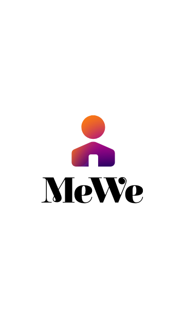
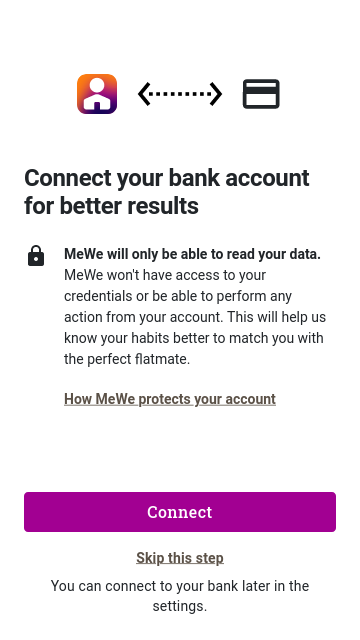
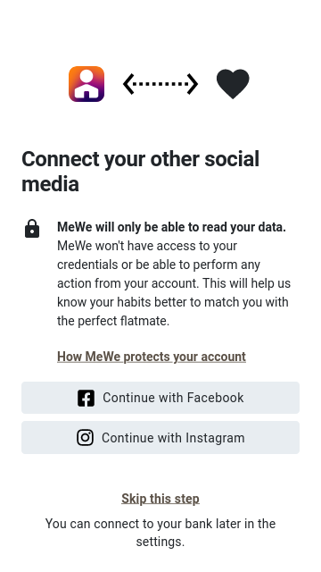
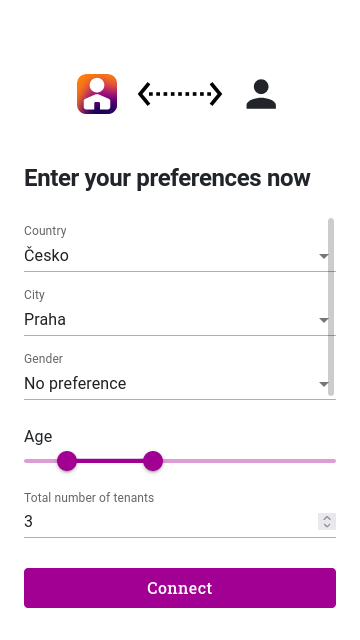
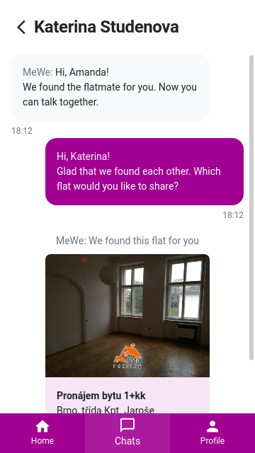

# MeWe app

MeWe finds perfect flatmates based on personality features extracted from bank statements and social media profiles.

App screenshots:

   &nbsp;
   &nbsp;
   &nbsp;
   &nbsp;
   &nbsp;
   &nbsp;

## Architecture

Stack built on `docker-compose` exposes two machines:
* `api`: matches tenants with flats. Calls flatzone
to find matching rental offers. Scores each offer based on provided importance per category, uses distances to matching POIs in close area. Uses OSM API to fetch POIs.

    Built using FastAPI for Python, GraphQL client and an OSM client library.
* `webapp`: provides end users with a web app.

    Stack: React with Material UI elements, styled to match [Figma designs](https://www.figma.com/file/dUYJ9vuVABUupIZe1CCBVK/App?node-id=0%3A1) created during the hackathon.
